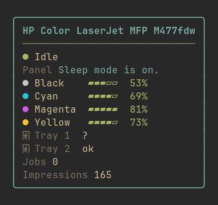
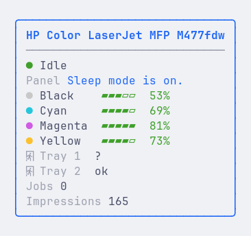
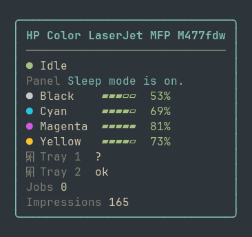

# printbar

[](https://aur.archlinux.org/packages/printbar)
[](LICENSE)

A generic printer monitor for [Waybar](https://github.com/Alexays/Waybar): status, supply levels, trays, jobs and the printer's own panel messages — for **any** printer, over the network or USB, with no vendor lock-in.

<p align="center">
  
</p>

<p align="center">
  <em>A compact line in your bar — hover for the full, themed panel:</em><br><br>
  
</p>

## Why printbar?

- **Any printer, any connection.** Network printers over **IPP** (AirPrint) and **SNMP** (Printer MIB), or local/USB queues over **CUPS** — all in one widget. Supplies are generic, so toner, ink, drums and waste tanks all work, on lasers and inkjets alike.
- **Never breaks your bar.** Every path — an unreachable printer, a disabled protocol, a malformed response, even a corrupt config — still prints valid Waybar JSON and exits 0. A failing source never blanks the others; SNMP is pure enrichment on top of the IPP/CUPS base.
- **The printer's own words.** The tooltip surfaces the literal text from the printer's front panel (`Ready`, `Paper jam in tray 2`, `Sleep mode is on.`) plus a list of active conditions — not just a generic status.
- **Real-time when you print.** An optional push service refreshes the bar the instant a job hits the queue, so you see `Printing` and the job count within a second — no waiting for the poll.
- **A tooltip worth opening.** A framed, column-aligned panel with per-toner color swatches and level bars, color-coded by threshold, that picks up your [Omarchy](https://omarchy.org) theme.

## Features

- Multi-source collector: **IPP** (network + local CUPS at `localhost:631`) merged with **SNMP** Printer MIB enrichment — most usable data wins, partial sources never suppress fuller ones
- Generic supplies (toner / ink / drum / waste) with per-color levels, capacity normalization and RFC 3805 sentinel handling (`unknown`, `some-remaining`, `no-restriction`)
- Printer status (idle / printing / stopped / offline) and active conditions: jam, cover open, media empty/low, supply low/empty
- The printer's front-panel display text via `prtConsoleDisplayBufferText` (fetched by direct GET, so it works even on agents that skip it on walk)
- Paper trays, queued jobs, and lifetime impressions
- Fully configurable: the bar via a template (`{supply_min}`, `{black}`, `{status_icon}`, …), the tooltip via an item list — with per-section hide-or-show-error on missing data
- Worst-state CSS classes for bar styling (`ok` / `warn` / `critical` / `error` / `offline`)
- Click actions: open the printer's web panel (EWS) or its CUPS queue
- Desktop notifications on state transitions (jam, supply low, offline) — anti-spam, best-effort
- Optional **instant push**: a systemd user service refreshes the bar the moment you print (CUPS event → Waybar signal)
- Omarchy theme colors, Nerd Font icons, single Rust binary — no runtime dependencies

## Requirements

- [Waybar](https://github.com/Alexays/Waybar)
- A network printer (IPP/SNMP) and/or a configured CUPS queue (covers USB)
- A [Nerd Font](https://www.nerdfonts.com/) for icons
- Optional: `cups` (CUPS source + queue action + instant push), `libnotify` (notifications), `xdg-utils` (click actions)

## Installation

### Arch Linux (AUR)

```bash
yay -S printbar
```

### From source

```bash
git clone https://github.com/mryll/printbar
cd printbar
make build
make install PREFIX=~/.local   # installs printbar, printbar-watch and the systemd unit
```

## Quick start

Create `~/.config/printbar/config.toml` with one section per printer:

```toml
[printer.office]
host = "192.168.1.70"        # enables IPP (+ SNMP if snmp.enabled); omit for USB-only
cups = "HP_M477fdw"          # optional: the local CUPS/IPP queue (covers USB)

[printer.office.snmp]
enabled = true               # explicit; community alone does NOT enable SNMP
community = "public"
```

Add the module to your Waybar config (the section name is the argument):

```jsonc
"custom/printbar": {
  "exec": "printbar office",
  "return-type": "json",
  "interval": 30,
  "signal": 15,
  "tooltip": true,
  "on-click": "printbar action ews --printer office",
  "on-click-right": "printbar action queue --printer office"
}
```

Then add `"custom/printbar"` to a `modules-*` list and restart Waybar. A full reference lives in [`config.example.toml`](config.example.toml).

## Configuration

### Bar tokens

`{supply_min}` (worst consumable), `{toner_min}`, `{ink_min}`, `{black}` `{cyan}` `{magenta}` `{yellow}`, `{status}`, `{status_icon}`, `{model}`, `{name}`, `{jobs}`, `{impressions}`, `{paper}`.

A hidden token (when its data is absent and `on_missing = "hide"`) takes any adjacent literal with it, so `"{supply_min}%"` never leaves a dangling `%`.

```toml
[printer.office.bar]
format = "\U000f042a {supply_min}%"   # \U000f042a = Nerd Font printer glyph (aligns better than an emoji)
on_missing = "hide"          # "hide" | "error"
```

### Tooltip items

`model`, `status`, `alerts`, `display` (panel text), `supplies`, `paper`, `jobs`, `impressions`. Long lists fold at `max_rows`.

```toml
[printer.office.tooltip]
items = ["model", "status", "alerts", "display", "supplies", "paper", "jobs", "impressions"]
max_rows = 12
```

### Thresholds and styling

The bar emits a `class` of the worst current state, so you can color it:

```toml
[printer.office.thresholds]
supply_low = 15
supply_critical = 5
```

```css
#custom-printbar.warn     { color: #e5c07b; }
#custom-printbar.critical { color: #e06c75; }
#custom-printbar.offline  { color: #5c6370; }
```

Tooltip colors come from your Omarchy theme (`~/.config/omarchy/current/theme/colors.toml`) with a sensible fallback.

### Themes

The tooltip follows your active Omarchy theme:

| Gruvbox | Catppuccin Latte | Everforest |
| --- | --- | --- |
|  |  |  |

### Click actions and notifications

```toml
[printer.office.actions]
on_click = "ews"             # opens the printer's web panel (default http://host)
on_click_right = "queue"     # opens the CUPS queue

[printer.office.notify]
enabled = true
events = ["jam", "supply_low", "offline"]
```

## Instant updates

By default the module polls on its Waybar `interval`. For an instant refresh the moment you print, enable the push service — it subscribes to CUPS print events and signals Waybar (no polling):

```bash
systemctl --user enable --now printbar-watch
```

> [!NOTE]
> The service sends `SIGRTMIN+15` to Waybar by default; set `PRINTBAR_WAYBAR_SIGNAL` (via `systemctl --user edit printbar-watch`) to match your module's `signal` if you change it.

## How it works

printbar is a one-shot binary. On each poll it runs its sources concurrently on threads, each with its own timeout, and merges their partial views into one state before rendering. IPP and the local CUPS queue share a single attribute parser; SNMP adds page counts, trays, alerts and the panel text on top. Supplies are taken wholesale from the source with the most usable entries, so a partial reading never hides a fuller one. Any source that fails, times out, or returns garbage is dropped — the rest still render, and a fully unreachable printer shows `offline`.

## Troubleshooting

> [!TIP]
> Run `printbar <name>` directly in a terminal to see the raw JSON and any error message.

- **No supplies or trays?** Those need SNMP — set `[printer.<name>.snmp] enabled = true`. A USB-only printer (CUPS, no `host`) reports whatever the queue exposes, which may be status and jobs only.
- **`offline` when the printer is on?** Check the `host`/`ipp_path` and that the printer answers IPP at `ipp://host/ipp/print` (some printers use a different path).
- **Tooltip colors look off?** printbar reads `~/.config/omarchy/current/theme/colors.toml`; without it, it falls back to a built-in palette.
- **Push doesn't fire?** It needs CUPS with D-Bus notifications; check `systemctl --user status printbar-watch` and that the module `signal` matches `PRINTBAR_WAYBAR_SIGNAL`.
