# printbar

[](https://aur.archlinux.org/packages/printbar)
[](LICENSE)

A printer monitor for [Waybar](https://github.com/Alexays/Waybar) and the [Omarchy](https://omarchy.org) shell. It shows the status of the printer, the supply levels, the trays, the queue and the text on the front panel of the printer. It does this for **any** printer, on the network or on USB, and it does not depend on one vendor.

One collector, two frontends:

| Waybar tooltip | Omarchy shell panel |
| :---: | :---: |
| 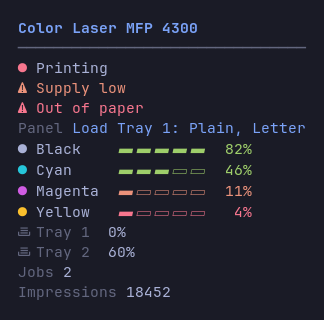 | 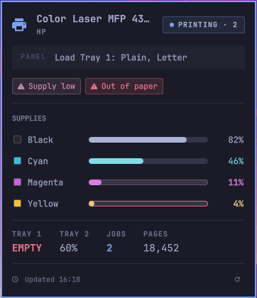 |

## Why printbar?

- **Any printer, any connection.** Network printers over **IPP** (AirPrint) and **SNMP** (Printer MIB), plus local and USB queues over **CUPS** — all in one widget. The supplies are generic, so printbar shows toner, ink, drums and waste tanks, on laser printers and on inkjet printers.
- **It never breaks your bar.** printbar always prints valid Waybar JSON and exits with code 0: an unreachable printer, a disabled protocol, a bad response, even a corrupt config. One source that fails does not make the other sources empty.
- **The words of the printer.** The tooltip shows the literal text on the front panel of the printer (`Ready`, `Paper jam in tray 2`, `Load Tray 1: Plain, Letter`) and the list of the active conditions.
- **Real time when you print.** An optional push service refreshes the bar immediately when a job goes into the queue. You see `Printing` and the count of the jobs in approximately one second.
- **It follows your theme.** printbar resolves the severity colors, the supply gauge and the ink swatches one time, from your Omarchy theme or your pywal cache. The two frontends then render from the same thresholds.

## Features

- Multi-source collector: printbar merges **IPP** (network, and the local CUPS queue at `localhost:631`) with **SNMP** Printer MIB data. printbar uses the source with the most data, and a partial source never hides a source with more data.
- Generic supplies (toner / ink / drum / waste) with levels for each color, capacity normalization and support for the RFC 3805 sentinel values (`unknown`, `some-remaining`, `no-restriction`).
- Printer status (idle / printing / stopped / offline) and active conditions: jam, cover open, media empty or low, supply low or empty.
- The front-panel display text from `prtConsoleDisplayBufferText`. printbar gets it with a direct GET, so it also operates with agents that do not include it in a walk.
- Paper trays, the jobs in the queue and the lifetime impressions.
- Configurable output: the bar with a template (`{supply_min}`, `{black}`, `{status_icon}`, …), the tooltip with a list of items. Each one can hide the missing data or show an error.
- Worst-state CSS classes to style the bar (`ok` / `warn` / `critical` / `error` / `offline`).
- Monochrome mode: `--no-color[=all|bar|tooltip]` and `NO_COLOR`, for a plain bar that you style with your own CSS.
- Click actions: printbar opens the web panel (EWS) of the printer or its CUPS queue.
- Desktop notifications when the state changes (jam, supply low, offline). They have anti-spam control and they are best-effort.
- Optional **instant push**: a systemd user service refreshes the bar immediately when you print (CUPS event → Waybar signal).
- Structured `--json` output for other frontends, and a native **Omarchy shell** plugin that uses it.
- One Rust binary. No runtime dependencies.

## Requirements

- [Waybar](https://github.com/Alexays/Waybar), or the [Omarchy](https://omarchy.org) shell, or both.
- A network printer (IPP/SNMP), or a configured CUPS queue (this includes USB), or both.
- A [Nerd Font](https://www.nerdfonts.com/) for the icons. It is recommended for all modes, and it is necessary for the framed tooltip (`frame = true`).
- Optional: `cups` (CUPS source, queue action, instant push), `libnotify` (notifications), `xdg-utils` (click actions).

## Installation

### Arch Linux (AUR)

```bash
yay -S printbar        # builds from source
yay -S printbar-bin    # prebuilt binary
```

### From source

```bash
git clone https://github.com/mryll/printbar
cd printbar
make build
make install PREFIX=~/.local   # installs printbar, printbar-watch and the systemd unit
```

## Quick start

Create `~/.config/printbar/config.toml` with one section for each printer:

```toml
[printer.office]
host = "192.0.2.70"          # enables IPP (+ SNMP if snmp.enabled); omit for USB-only
cups = "HP_M477fdw"          # optional: the local CUPS/IPP queue (covers USB)

[printer.office.snmp]
enabled = true               # explicit; community alone does NOT enable SNMP
community = "public"
```

Add the module to your Waybar configuration file. The name of the section is the argument:

```jsonc
"custom/printbar": {
  "exec": "printbar office",
  "return-type": "json",
  "interval": 30,
  "signal": 15,
  "tooltip": true,
  "on-click": "printbar action ews --printer office",
  "on-click-right": "printbar action queue --printer office"
}
```

Then add `"custom/printbar"` to a `modules-*` list. Start Waybar again.

<p align="center">
  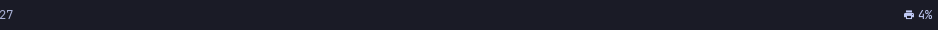
</p>

The full reference of the options is in [`config.example.toml`](config.example.toml).

## Configuration

### Bar tokens

`{supply_min}` (worst consumable), `{toner_min}`, `{ink_min}`, `{black}` `{cyan}` `{magenta}` `{yellow}`, `{status}`, `{status_icon}`, `{model}`, `{name}`, `{jobs}`, `{impressions}` (or `{pages}`), `{paper}`.

If printbar hides a token, it also removes the adjacent literal text. So `"{supply_min}%"` never leaves an unwanted `%`.

```toml
[printer.office.bar]
format = "\U000f042a {supply_min}%"   # \U000f042a = the Nerd Font printer glyph
on_missing = "hide"                   # "hide" | "error"
```

> [!TIP]
> Use the Nerd Font glyph and not the 🖨 emoji. The emoji is not aligned with the baseline of the bar.

### Tooltip items

`model`, `status`, `alerts`, `display` (the front-panel text), `supplies`, `paper`, `jobs`, `impressions`. printbar folds long lists at `max_rows`.

```toml
[printer.office.tooltip]
items = ["model", "status", "alerts", "display", "supplies", "paper", "jobs", "impressions"]
max_rows = 12
# Draw the bordered box and pin a Mono Nerd Font, so the rows stay aligned under any bar font.
# Off (the default) = plain, borderless, in your own font.
frame = false
# The font pinned when frame = true. It must be a complete Mono Nerd Font.
frame_font = "JetBrainsMono Nerd Font Mono"
```

### Thresholds and styling

The bar emits a `class` for the worst current state, so your CSS can set its color:

```toml
[printer.office.thresholds]
supply_low = 15
supply_critical = 5
```

```css
#custom-printbar.warn     { color: #e5c07b; }
#custom-printbar.critical { color: #e06c75; }
#custom-printbar.offline  { color: #5c6370; }
```

Those two numbers also set the supply gauge. A supply at or below `supply_critical` is critical, at or below `supply_low` is warn, and a higher value is ok. The core decides that `state` one time. Both frontends render the same verdict, but they show it in different ways. The Waybar tooltip gives the level text a severity color. The panel paints each meter in the **physical color of the colorant**, because cyan toner is cyan. The severity moves to the outline of the meter. A red-to-green ramp made an almost empty cartridge and a full one difficult to tell apart.

### Click actions and notifications

```toml
[printer.office.actions]
on_click = "ews"             # opens the printer's web panel (default http://host)
on_click_right = "queue"     # opens the CUPS queue

[printer.office.notify]
enabled = true
events = ["jam", "supply_low", "offline"]
```

## Theming

printbar resolves the colors one time, for all frontends, in this sequence:

1. Your active **Omarchy** theme — `$XDG_STATE_HOME/omarchy/current/theme/colors.toml` (`~/.local/state/...` by default). The pre-4.x `~/.config/omarchy/...` path is the fallback.
2. Your **pywal** cache — `$XDG_CACHE_HOME/wal/colors.json` (`~/.cache/...` by default). printbar reads it only when no Omarchy theme is installed. `pywal16` and `wallust` write the same file, so one path is sufficient for all three.
3. A built-in **One Dark** palette.

Each value degrades independently. If your theme does not include a key, or if a key has a bad value, printbar uses the fallback for that key only. It does not discard the full palette. pywal has no accent slot and no orange slot. So `color4` (or `special.cursor`) becomes the accent, and orange is the midpoint of yellow and red.

| Flexoki Light | Rosé Pine | Hackerman |
|:---:|:---:|:---:|
| 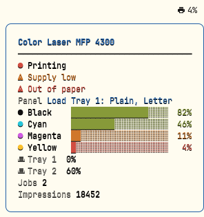 | 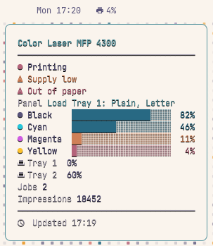 |  |

| Ristretto | Nord | Kanagawa |
|:---:|:---:|:---:|
| 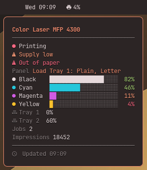 | 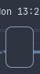 | 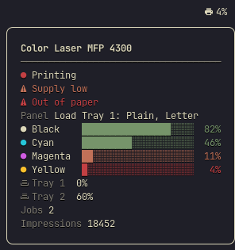 |

> [!NOTE]
> **An upgrade from an earlier version?** The detection of the Omarchy theme was defective. printbar read the pre-4.x path and needed a legacy `color1` key, so the tooltips used the built-in palette and not your theme. This is now correct, and your colors follow the real theme.
>
> Two more items changed on the screen. printbar now resolves the supply gauge one time and publishes it in the JSON as `palette.stops`. The tooltip and the Omarchy panel then always agree with your `[thresholds]`. The tray rows in the tooltip now use the correct glyph and not `nf-md-exit_run`, which shows a person who runs through a doorway.

The ink swatches are not part of the theme. Cyan toner is cyan with all themes. Only black is different. The true color of black ink is almost black. Some surfaces draw the swatch as a bare glyph. On those surfaces printbar uses the text color of the theme, which is always legible there.

### Monochrome mode

Do you prefer a plain bar? Turn the colors off, for all surfaces or for one surface only:

```bash
printbar office --no-color            # same as --no-color=all
printbar office --no-color=bar        # plain bar text, colored tooltip
printbar office --no-color=tooltip    # colored bar text, plain tooltip
```

| invocation | bar text | tooltip |
| --- | --- | --- |
| *(nothing)* | colored | colored |
| `--no-color` / `--no-color=all` | plain | plain |
| `--no-color=bar` | plain | colored |
| `--no-color=tooltip` | colored | plain |

Plain means no color markup on that surface. Nothing else changes. The printer glyph, the `▰▱` level cells, the status dot, the alignment, the box drawing and the bold model header stay in their positions.

| Monochrome tooltip | Monochrome panel (`"colorMode": "none"`) |
| :---: | :---: |
| 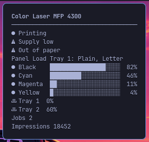 | 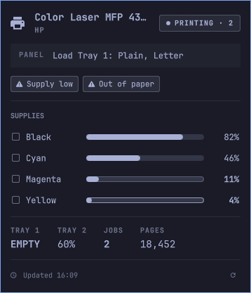 |

printbar also obeys [`NO_COLOR`](https://no-color.org). A value that is not empty has the same effect as `--no-color=all`. An explicit flag on the command line always has more priority. For example, `--no-color=bar` keeps the tooltip colored with `NO_COLOR`, because the flag is the more specific instruction.

**Monochrome mode plus CSS classes is the "style it yourself" path.** The `class` field never changes with `--no-color`, because it is a machine contract. So a plain bar and your own stylesheet give you only the colors that you selected:

```jsonc
"custom/printbar": { "exec": "printbar office --no-color=bar", "return-type": "json" }
```

```css
#custom-printbar          { color: #d0d0d0; }
#custom-printbar.warn     { color: #e5c07b; }
#custom-printbar.critical { color: #e06c75; }
```

## Instant updates

By default, the module reads the data at its Waybar `interval`. To refresh the bar immediately when you print, enable the push service. The service subscribes to the CUPS job events and sends a signal to Waybar. It uses no poll cycle:

```bash
systemctl --user enable --now printbar-watch
```

> [!NOTE]
> The service sends `SIGRTMIN+15` to Waybar by default. If you change the `signal` of your module, set `PRINTBAR_WAYBAR_SIGNAL` to the same value (`systemctl --user edit printbar-watch`).

## Omarchy shell plugin

printbar also has a native plugin for the bar of the [Omarchy](https://omarchy.org) shell. It uses the same collector, but it renders a real widget and not a Pango tooltip.

<p align="center">
  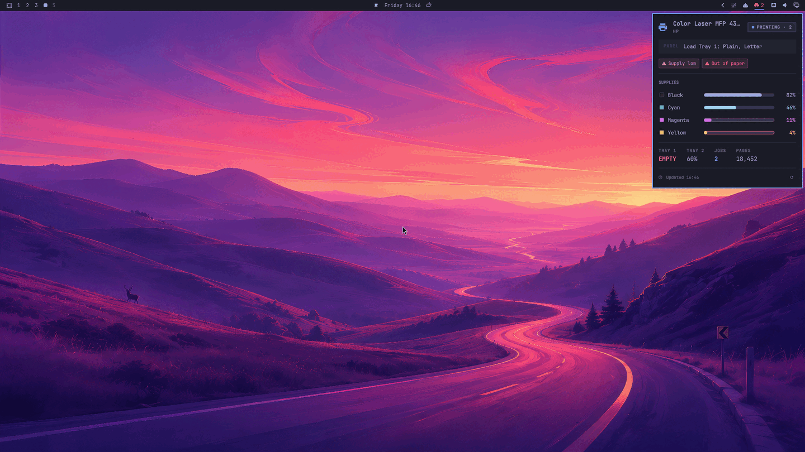
</p>

<p align="center">
  
</p>

The bar shows a printer glyph. The glyph is muted when the printer is idle, and it shows the count of the jobs when the printer prints. An urgent tint shows a jam, a critical state or an offline state.

A left click opens a themed panel with the front-panel words of the printer. The panel also shows ink swatches for each supply, animated level meters, trays and job statistics. A right click opens the web panel (EWS) of the printer. A middle click refreshes the data. The footer of the panel ends with a refresh control (󰑐), next to the time of the last update. The control stays disabled while a fetch runs. The Waybar mode does not change — the plugin is an added frontend, not a replacement.

```bash
make install PREFIX=~/.local   # the plugin runs the printbar binary from PATH
make install-omarchy           # symlinks the repo to ~/.config/omarchy/plugins/mryll.printbar
```

Then add the widget to a bar section in `~/.config/omarchy/shell.json`:

```jsonc
"bar": {
  "layout": {
    "right": [
      { "id": "mryll.printbar", "printerName": "office" }
    ]
  }
}
```

Settings, which you can also change in the widget settings UI of the shell:

| Key | Type | Default | Meaning |
|---|---|---|---|
| `printerName` | string | `office` | The `[printer.<name>]` section in the config.toml file of printbar |
| `refreshIntervalSec` | integer | `30` | Poll interval in seconds (5–3600) |
| `configPath` | path | *(empty)* | Override for the config file, given as `PRINTBAR_CONFIG` |
| `hideWhenIdle` | boolean | `false` | Show the widget only when the printer prints, or on a warning or an error |
| `colorMode` | enum | `full` | `full` \| `none` \| `bar-only` \| `panel-only` — the monochrome switch of the plugin |

`colorMode` is equivalent to the `--no-color` states of the CLI, but for the widget. `none` is monochrome on all surfaces. `bar-only` keeps the bar glyph colored with a monochrome panel, and `panel-only` does the opposite.

Monochrome mode uses only foreground and dimmed-foreground tones, with no accent, no urgent tint and no ink colors. You can still see the severity in the status label, the condition pills, the bold percentage and the outlined meter track. The plugin never passes `--no-color` to the binary. It reads the structured JSON, which has no colors, and then it decides its own colors.

The panel keeps the last good reading if a failure occurs. A missing binary, output that printbar cannot parse, a schema mismatch or a structured error shows the cause above your last data. The panel does not become empty when it was correct one second before.

> [!IMPORTANT]
> The plugin directory is a symlink into this repository. The shell does not monitor the files in a plugin directory that is a symlink. After you edit a `.qml` file, run `omarchy restart shell`. A `rescanPlugins` call is not sufficient, because it does not compile the QML again.

> [!NOTE]
> The push service (`printbar-watch`) sends a signal to **Waybar** with `SIGRTMIN+N`, which is a Waybar mechanism only. The Omarchy plugin does not receive this signal. It uses its poll interval, and it also refreshes when the panel opens and on a middle click.

The panel follows the live theme tokens of the shell, so it changes its colors immediately when you change the theme:

| Flexoki Light | Rosé Pine | Hackerman |
|:---:|:---:|:---:|
| 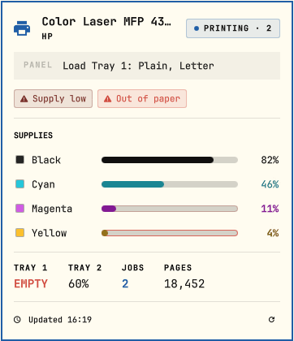 | 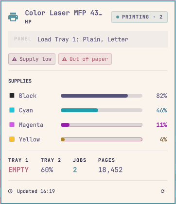 | 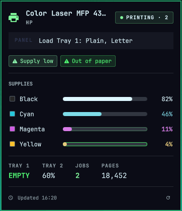 |

| Ristretto | Nord | Kanagawa |
|:---:|:---:|:---:|
| 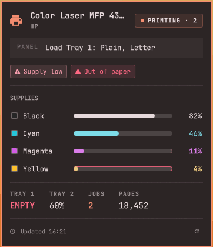 | 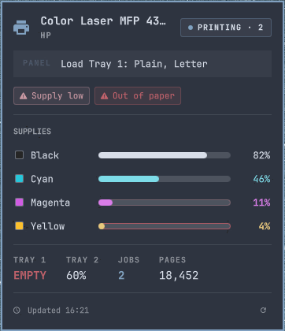 | 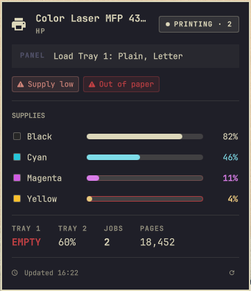 |

## Structured JSON output

`printbar <name> --json` prints one document with raw data only. It has no Pango markup and no pre-drawn bars. The Omarchy plugin reads this document, and all other frontends can also use it. The `schema_version` field gives its version. Like the Waybar mode, it always exits with code 0. A failure gives `"state": "error"` and `"error": {"message": …}`, and the fields of the reading are empty.

The document contains the status, the worst-state `state` and the active `reasons`. It also contains the `supplies` with their `level_pct` and their own `state`, the `trays`, the `jobs` count and the `impressions`. Last, it contains the front-panel `display` text and the `ews_url` / `queue_url` that the click actions open.

The document also contains a `palette`. The palette has the severity colors from your theme: `ok`, `warn`, `critical`, `offline`, `error` and `unknown`. It also has the physical `ink` color of each colorant, and the `stops` of the supply gauge. The stops give the ramp as a color *and* the percent of each band, directly from your `[thresholds]`:

```jsonc
"stops": [
  { "pct": 5,   "state": "critical", "color": "#e06c75" },  // at or below 5%
  { "pct": 15,  "state": "warn",     "color": "#d19a66" },  // at or below 15%
  { "pct": 100, "state": "ok",       "color": "#98c379" }
]
```

The core resolves the thresholds one time. The same code decides the `state` of each supply, so a published stop cannot become different from the verdict. The two frontends render from it, each in its own idiom (see above). If you change a threshold, or if you use pywal only, the panel and the tooltip change together. `palette` is `null` in an error document, which has no reading to show in color.

`--no-color` never changes this document. `--json` is applicable to the monitor output only. With `printbar action …`, it does no action and returns a structured error.

## How it works

printbar is a one-shot binary. At each cycle it runs its sources on parallel threads, each one with its own timeout. Then it merges their partial views into one state, and it renders that state.

IPP and the local CUPS queue use the same attribute parser. SNMP adds the page counts, the trays, the alerts and the panel text. printbar takes the supplies from the source with the most usable entries, so a partial reading never hides a reading with more data. printbar removes each source that fails, that stops at its timeout, or that returns bad data. The other sources still render, and a printer that printbar cannot reach shows `offline`.

## Troubleshooting

> [!TIP]
> Run `printbar <name>` in a terminal to see the raw JSON and the error messages. Add `--json` to see the structured document that the plugin reads.

- **Do you see no supplies or trays?** These items need SNMP. Set `[printer.<name>.snmp] enabled = true`. A USB-only printer (CUPS, with no `host`) reports only the data of the queue, which is usually the status and the jobs.
- **Does printbar show `offline` when the printer is on?** Check `host` and `ipp_path`. Then make sure that the printer answers IPP at `ipp://host/ipp/print`. Some printers use a different path.
- **Do the colors look incorrect?** printbar reads `~/.local/state/omarchy/current/theme/colors.toml` (Omarchy 4.x, printbar obeys `XDG_STATE_HOME`), then the legacy `~/.config/omarchy/current/theme/colors.toml`, then the pywal file `~/.cache/wal/colors.json` (printbar obeys `XDG_CACHE_HOME`), then its built-in palette. printbar reads the named keys (`accent`, `blue`, `foreground`, `background`, `red`, `green`, `yellow`, `orange`) and also accepts the legacy `color1` … `color4` keys.
- **Does the widget show "not installed or not on PATH"?** The Omarchy plugin runs `printbar` from `PATH`. Run `make install PREFIX=~/.local`. Then make sure that `~/.local/bin` is in the PATH that the shell had when it started.
- **Did you edit the QML and nothing changed?** Run `omarchy restart shell`.
- **Does the push service not operate?** It needs CUPS with D-Bus notifications. Check `systemctl --user status printbar-watch`. Then make sure that the `signal` of your module agrees with `PRINTBAR_WAYBAR_SIGNAL`.
